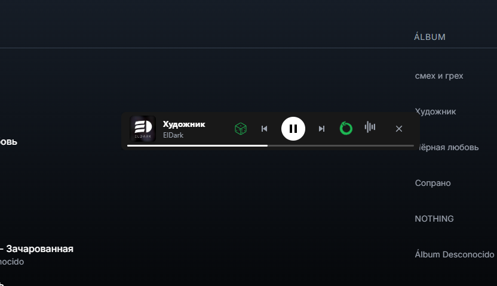

# 🎵 Helios - A Music Player for People Who Love Audio

Helios is a minimalist, quality-focused desktop music player born from frustration with existing platforms. Tired of streaming services not having the music I wanted at the desired quality, and of bloated offline players saturated with useless options and unappealing interfaces, I decided to build my own solution.

This project is for audiophiles, collectors, and anyone who values a clean, fast, and local music experience.

---

## ✨ Screenshots

A glimpse into the clean, modern, and powerful interface of Helios.

| Main Library View (Home) | Detailed Playlist View |
| :------------------------------: | :-----------------------------: |
|  |  |
| **Floating Mini-Player (Square & Bar Modes)** |
|  |
|  |

---

## ⭐ Key Features

Helios is designed around three pillars: performance, audio quality, and a seamless user experience, demonstrated by its fluid and responsive interface.

### 🚀 Performance & Library
* **Instantaneous Startup:** Thanks to **persistent caching with IndexedDB**, your library of thousands of songs loads instantly after the first scan.
* **Fluid Interface:** The UI is optimized to handle massive libraries without freezing or slowing down, featuring smooth transitions between views.
* **Local Management:** Full control over your music. Simply add your folder, and Helios handles the rest.

### 🎧 Playback Experience
* **Advanced Mini-Player:** A floating, independent **"Always On Top"** window that you can place anywhere over your other applications.
    * **Adaptive Dual-Design:** Automatically transforms from a sleek "Bar Mode" to a cover-art-focused "Square Mode" when you resize it.
    * **Perfect Sync:** All controls (play, progress, volume) are synchronized in real-time with the main window.
* **Superior Audio Quality:**
    * **10-Band Graphic Equalizer:** Fine-tune the sound with a real-time pop-up EQ panel powered by the Web Audio API.
    * Support for high-quality formats (`.flac`, `.wav`, `.mp3`, etc.).
* **"Fast Jump" to Current Song:** Instantly navigate to the currently playing track's position in any playlist with a single click on the cover art in the sidebar.
* **Slide-Out Play Queue:** Manage what's next with a dedicated panel that slides smoothly into view. Supports **Drag & Drop** for reordering your upcoming tracks.
* **Error Detection:** If a song is corrupt, Helios will automatically skip it and notify you, keeping your music uninterrupted.

### 🎨 UI & Customization
* **Polished & Interactive UI:** Experience thoughtful micro-interactions that enhance usability, like hover-to-play buttons appearing on track numbers and album art.
* **Full Session Restore:** Helios remembers everything: the last song you listened to, the exact second, the shuffle/repeat state, and your equalizer settings, providing a seamless continuation of your listening session.
* **Clean, Modern Design:** An interface inspired by the best music apps, but without the clutter. Built with a focus on readability and aesthetics.

---

## 🛠️ Tech Stack

This project is built with modern web technologies, packaged as a native, cross-platform desktop application.

* **Core Framework:** **Electron**
* **Frontend:** HTML5, CSS3, and **JavaScript (ES6+ Modules)** (no frameworks like React or Vue!)
* **Styling:** **Tailwind CSS** for rapid and consistent design.
* **Database (Cache):** **IndexedDB** for library persistence.
* **User Settings:** **localStorage**
* **Metadata Parsing:** `jsmediatags`

---

## 🚀 Getting Started (Development Mode)

You need to have [Node.js](https://nodejs.org/) and npm installed on your system.

1.  **Clone the repository:**
    ```bash
    git clone [https://github.com/your-username/helios.git](https://github.com/your-username/helios.git)
    cd helios
    ```

2.  **Install dependencies:**
    ```bash
    npm install
    ```

3.  **Run the application:**
    ```bash
    npm start
    ```

The application will launch in a desktop window. Thanks to `electron-reloader`, any changes you save in the source code will automatically refresh the app.

---

## 🗺️ Roadmap (Potential Future Features)

Helios is an evolving project. Some ideas for the future include:
* [ ] Theming support (light/dark modes).
* [ ] Built-in metadata editor.
* [ ] Audio visualizers.
* [ ] Lyrics support.
* [ ] Plugin system to extend functionality.

---

## 🤝 How to Contribute

Contributions are welcome! If you have ideas, suggestions, or want to fix a bug, please open an "Issue" to discuss it or submit a "Pull Request."

1.  Fork the Project.
2.  Create your Feature Branch (`git checkout -b feature/AmazingFeature`).
3.  Commit your Changes (`git commit -m 'Add some AmazingFeature'`).
4.  Push to the Branch (`git push origin feature/AmazingFeature`).
5.  Open a Pull Request.

---

## 📄 License

This project is licensed under the MIT License. See the `LICENSE` file for more details.