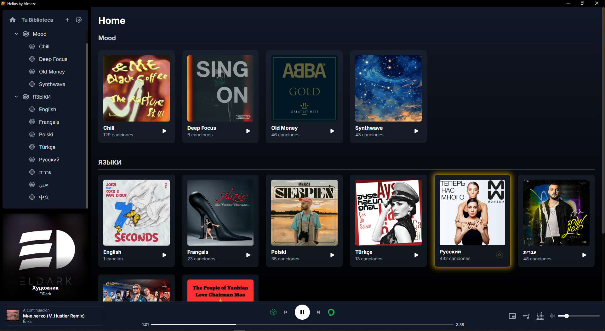
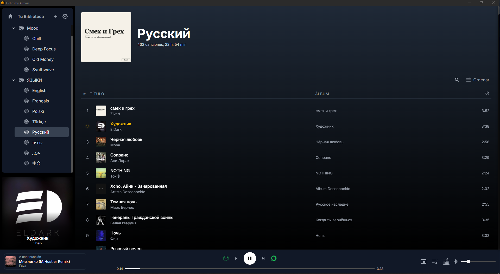
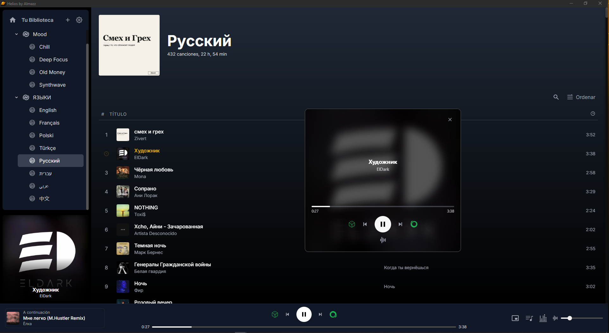

# 🎵 Helios - A Music Player for People Who Love Audio

Helios is a minimalist, quality-focused desktop music player born from frustration with existing platforms. Tired of streaming services not having the music I wanted at the desired quality, and of bloated offline players saturated with useless options and unappealing interfaces, I decided to build my own solution.

This project is for audiophiles, collectors, and anyone who values a clean, fast, and local music experience.

---

## ✨ Screenshots

A glimpse into the clean, modern, and powerful interface of Helios.

| Main Library View (Home) | Detailed Playlist View |
| :------------------------------: | :-----------------------------: |
|  |  |
| **Floating Mini-Player (Square & Bar Modes)** |
|  |  |

---

## ⭐ Key Features

Helios is designed around three pillars: performance, audio quality, and a seamless user experience, demonstrated by its fluid and responsive interface.

### 🚀 Performance & Library
* **Instantaneous Startup:** Thanks to **persistent caching with IndexedDB**, your library of thousands of songs loads instantly after the first scan.
* **Fluid Interface:** The UI is optimized to handle massive libraries without freezing or slowing down, featuring smooth transitions between views.
* **Local Management:** Full control over your music. Simply add your folder, and Helios handles the rest.

### 🎧 Playback Experience
* **Advanced Mini-Player:** A floating, independent **"Always On Top"** window that you can place anywhere over your other applications.
    * **Adaptive Dual-Design:** Automatically transforms from a sleek "Bar Mode" to a cover-art-focused "Square Mode" when you resize it.
    * **Perfect Sync:** All controls (play, progress, volume) are synchronized in real-time with the main window.
* **Superior Audio Quality:**
    * **10-Band Graphic Equalizer:** Fine-tune the sound with a real-time pop-up EQ panel powered by the Web Audio API.
    * Support for high-quality formats (`.flac`, `.wav`, `.mp3`, etc.).
* **"Fast Jump" to Current Song:** Instantly navigate to the currently playing track's position in any playlist with a single click on the cover art in the sidebar.
* **Slide-Out Play Queue:** Manage what's next with a dedicated panel that slides smoothly into view. Supports **Drag & Drop** for reordering your upcoming tracks.
* **Error Detection:** If a song is corrupt, Helios will automatically skip it and notify you, keeping your music uninterrupted.

### 🎨 UI & Customization
* **Polished & Interactive UI:** Experience thoughtful micro-interactions that enhance usability, like hover-to-play buttons appearing on track numbers and album art.
* **Full Session Restore:** Helios remembers everything: the last song you listened to, the exact second, the shuffle/repeat state, and your equalizer settings, providing a seamless continuation of your listening session.
* **Clean, Modern Design:** An interface inspired by the best music apps, but without the clutter. Built with a focus on readability and aesthetics.

---

## 🛠️ Tech Stack

This project is built with modern web technologies, packaged as a native, cross-platform desktop application.

* **Core Framework:** **Electron**
* **Frontend:** HTML5, CSS3, and **JavaScript (ES6+ Modules)** (no frameworks like React or Vue!)
* **Styling:** **Tailwind CSS** for rapid and consistent design.
* **Database (Cache):** **IndexedDB** for library persistence.
* **User Settings:** **localStorage**
* **Metadata Parsing:** `jsmediatags`

---

## 🚀 Getting Started (Development Mode)

You need to have [Node.js](https://nodejs.org/) and npm installed on your system.

1.  **Clone the repository:**
    
    git clone [https://github.com/AlfonsoMazz/helios-music-player.git](https://github.com/AlfonsoMazz/helios-music-player.git)
    cd helios-music-player
    

2.  **Install dependencies:**
    
    npm install
    

3.  **Run the application:**
    
    npm start
    

The application will launch in a desktop window. Thanks to `electron-reloader`, any changes you save in the source code will automatically refresh the app.

---

## 🗺️ Roadmap (Potential Future Features)

Helios is an evolving project. Some ideas for the future include:
* [ ] Theming support (light/dark modes).
* [ ] Built-in metadata editor.
* [ ] Audio visualizers.
* [ ] Lyrics support.
* [ ] Plugin system to extend functionality.

---

## 🤝 How to Contribute

Contributions are welcome! If you have ideas, suggestions, or want to fix a bug, please open an "Issue" to discuss it or submit a "Pull Request."

1.  Fork the Project.
2.  Create your Feature Branch (`git checkout -b feature/AmazingFeature`).
3.  Commit your Changes (`git commit -m 'Add some AmazingFeature'`).
4.  Push to the Branch (`git push origin feature/AmazingFeature`).
5.  Open a Pull Request.

---

## 📄 License

This project is licensed under the MIT License. See the `LICENSE` file for more details.

---

## 🏛️ Project Architecture & File Breakdown

Helios is built on Electron, which splits the application into two main processes: the **Main Process** (which acts as the backend and manages windows) and the **Renderer Processes** (which are the windows containing the user interface, essentially a webpage).

### 📂 Electron Core (Main Process)

These files manage the desktop application itself, the windows, and low-level communication.

* `main.js`
    * **What it does:** This is the **brain and entry point** of the Electron application. It runs in a Node.js environment, not in the browser.
    * **Responsibilities:** It creates the operating system windows (`BrowserWindow`) for the main application and the Mini-Player. It manages the communication between these windows (IPC), the application's lifecycle events (open, close), and native functionality like "Always On Top".
    * **Interacts with:** `preload.js` (for secure communication), `index.html`, and `miniplayer.html` (by loading them into the windows).

* `preload.js`
    * **What it does:** It acts as a **secure bridge** between the Node.js environment (`main.js`) and the browser environment of the windows.
    * **Responsibilities:** It securely exposes functions from the Main Process to the Renderer Process through the `window.electronAPI` object. This prevents the web interface from having direct access to powerful and potentially dangerous Node.js functions.
    * **Interacts with:** `main.js` (receives and sends IPC messages) and the renderer files like `renderer.js` and `miniplayer-loader.js` (provides them with the API to communicate).

### 🖥️ Frontend (Renderer Processes)

These files build and control everything the user sees and interacts with.

* `index.html`
    * **What it does:** This is the HTML skeleton for the **main application window**.
    * **Interacts with:** It loads `renderer.js`, which is the script that brings it to life with functionality.

* `miniplayer.html`
    * **What it does:** This is the self-contained HTML skeleton for the **Mini-Player window**.
    * **Interacts with:** It loads `miniplayer-loader.js` for its internal logic.

* `renderer.js`
    * **What it does:** This is the **main frontend orchestrator** for `index.html`.
    * **Responsibilities:** It dynamically loads the UI components (`player.txt`, `sidebar.txt`, etc.), initializes all application modules (player, library, queue, etc.), and establishes the communication flows between them.
    * **Interacts with:** Practically all other `.js` files. It imports and initializes modules, manipulates the DOM, and uses `preload.js` to communicate with `main.js`.

* `miniplayer-loader.js`
    * **What it does:** This is the **exclusive JavaScript entry point for the Mini-Player**.
    * **Responsibilities:** Its sole task is to initialize the Mini-Player's logic (`miniPlayer.js`) and set up the listener that receives state updates from the main window via `main.js`.
    * **Interacts with:** `miniPlayer.js` (which it initializes) and `preload.js` (to receive data and send actions).

### 🧩 Application Logic (JS Modules)

The functional heart of the application, divided into modules with unique responsibilities.

* `js/state.js`
    * **What it does:** It's the **single source of truth**. It contains the `appState` object that stores all real-time information: the current song, playback status, the loaded library, volume, etc.
    * **Interacts with:** It is imported by almost all other modules. Some read from it (to render the UI), and others write to it (to update the state).

* `js/player.js`
    * **What it does:** Controls all **audio playback logic**.
    * **Responsibilities:** It manages the `<audio>` element, the equalizer (Web Audio API), the logic for play/pause, next/previous, shuffle, repeat, and handling file errors.
    * **Interacts with:** `appState` (which it constantly modifies), `renderer.js` (which initializes it), and calls callback functions to update the UI in `sidebar.js` and `mainView.js`.

* `js/library.js` & `js/cache.js`
    * **What they do:** They manage the music library. `library.js` reads file metadata and builds the folder/track tree, while `cache.js` is responsible for **saving and loading that tree into the IndexedDB database** for a near-instant startup.
    * **Interact with:** `renderer.js` (which initiates the loading) and `appState` (where the final library is stored).

* `js/mainView.js`, `js/views/homeView.js`, `js/views/playlistView.js`
    * **What they do:** This set of files manages the **main content view**.
    * **Responsibilities:** `mainView.js` acts as a controller that decides which view to display. `homeView.js` renders the home screen with playlist cards. `playlistView.js` renders the detailed track list for a selected playlist.
    * **Interact with:** `appState` (to get the data to display) and `player.js` (to start playback when a user clicks a song).

* `js/sidebar.js`
    * **What it does:** Controls the **left sidebar**.
    * **Responsibilities:** It renders the playlist/folder tree, manages folder expansion/collapse, and updates the "Now Playing" section at the bottom.
    * **Interacts with:** `mainView.js` (to tell it which playlist to display) and `player.js` (receives information about the current song to display it).

* `js/views/miniPlayer.js`
    * **What it does:** Contains all the **UI logic for the Mini-Player** window itself.
    * **Responsibilities:** It updates the cover art, title, and progress bar. It manages the design switch between "square" and "bar" modes. It sends user actions (clicks on play, etc.) back to the main window.
    * **Interacts with:** `miniplayer-loader.js` (which initializes it) and `preload.js`.

* `js/settings.js` & `js/queue.js`
    * **What they do:** `settings.js` handles the persistence of user settings (volume, shuffle state, last session) in `localStorage`. `queue.js` manages the logic and UI of the play queue panel.
    * **Interact with:** `settings.js` is used by `appState` on startup and is called by various modules to save changes. `queue.js` interacts with `player.js` to get the list of upcoming tracks.

### 🧱 Components & Configuration

* `components/*.txt`
    * **What they are:** These are **HTML fragments** that define the structure of the main UI sections. They contain no logic.
    * **Interact with:** `renderer.js` loads them via `fetch` and injects them into `index.html` when the application starts.

* `package.json`
    * **What it is:** The project's **manifest file**. It defines dependencies (like Electron), scripts (`npm start`), and the application's entry point (`main.js`).
    * **Interacts with:** It's the first file read by Node.js/NPM to know how to install and run the project.